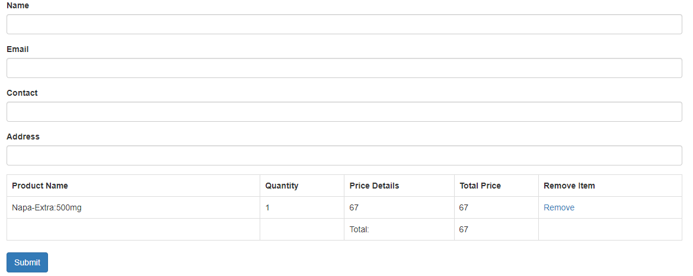

# Welcome to Medicine House
Medicine House is a platform where people can buy medicines on online. In our country, people generally buy medicines from different stores. Now the world is moving forward & we can see digitalization in every sector. So, we are building a platform where people can order their needed medicine from home & get those medicine at their doorstep as soon as possible.

<h4> Here, I will discuss some of my features.</h4>

## Search Option

Users will be able to search any medicines available in the inventory.
At first, a user will select the `Search bar` and type the full name or partial name of the medicine he wants to buy & click the `Search` button. He will find the medicines which matches the letters written in the `Search bar`.

## Payment Method

Users will add medicines to the cart by clicking on the `Add to Cart` button. Then they will have to make the payment. To do that they need to click on the `Payment` button. After clicking on the `Payment` button they will see a page like this:

Now they have to write down their `Name`, `Email`, `Contact`, `Address` and by clicking on the `Submit` button they can make the payment.

## Product Ratings & Reviews

Here users can give `Ratings` and write down their valueable `Reviews` on each product. To do this they need to click on `Ratings` button of a product. Then they will write down their `Name`, give `Ratings` and write down their opinion in the `Review` box and click on the `Submit` button. then everything will be shown in `List of Reviews ..`

code:

    