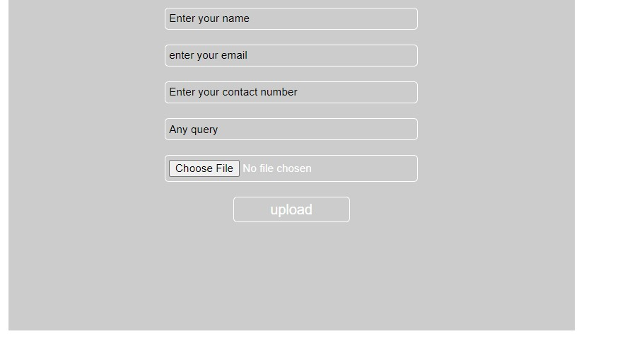
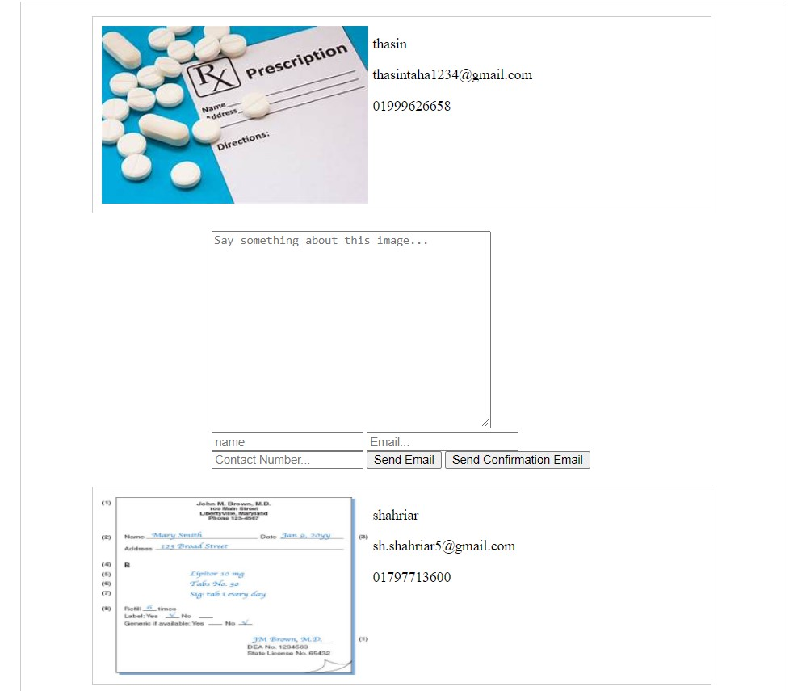

# Welcome to Medicine House
Medicine House is a platform where people can buy medicines on online. In our country, people generally buy medicines from different stores. Now the world is moving forward & we can see digitalization in every sector. So, we are building a platform where people can order their needed medicine from home & get those medicine at their doorstep as soon as possible.

<h4> Here, I will discuss some of my features.</h4>

## Prescription Upload
Users will be able to upload their prescriptions with the Prescription Upload feature.
To upload a prescription, users must first select the `Upload prescription` button from the dashboard that appears by logging in to their website.
After selecting the button, they will get a page like the picture.

On this page the user has to fill a form. Where they have to give their `name`, `email`, `contact number`, `any query` periodically and `upload a picture` of the prescription.

By clicking the `Upload` button will complete their upload and they will receive a `confirmation mail`.

## Show Prescription By Admin
This is an admin part. Admins will be able to login with their valid user ID, then they can select the Show Prescription button, after that they can see users uploaded prescriptions, and communicate with them via email if necessary.

If all medicines are available then admin can select the `Send Confirmation Email` button and user will get a confirmation email. If all medicines aren't available then they have to write something in the `text box` and select the `Send Email` button.

## Email Communication
Here, I use `smtp.gmail.com` for the email communication from localhost.

code:
     
     if (isset($_POST['submit'])) { 
            $name = $_POST['name']; 
            $email = $_POST['email'];
            $contactNumber = $_POST['contactNumber'];
            $text = $_POST['text'];

            $to_email = $email;
            $subject = "Medicine Delivery: ";
            $body =  $text." \n\n

                Online Medicine House";
            $headers = "From:ahasan181038@bscse.uiu.ac.bd";
            if(mail( $to_email, $subject, $body,  $headers)) {
                    echo "

                            

                        ";
                 }  
        }

Send mail configuration:

    smtp_server=smtp.gmail.com
    smtp_port=465
    error_logfile=error.log
    debug_logfile=debug.log
    auth_username=ahasan181038@bscse.uiu.ac.bd
    auth_password=********
    force_sender=ahasan181038@bscse.uiu.ac.bd

