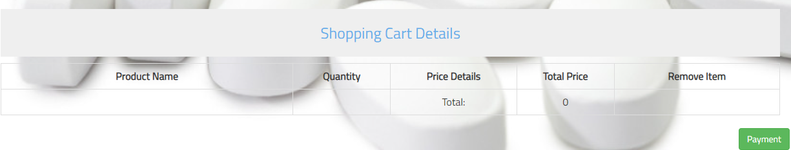
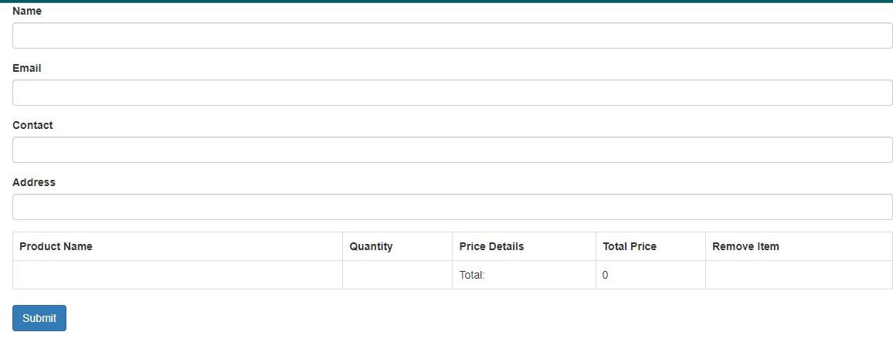
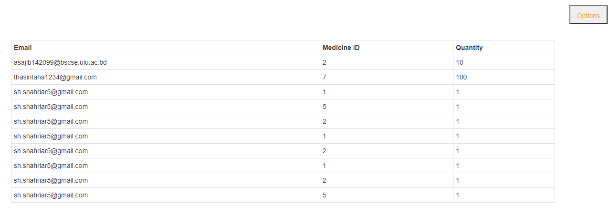

# Welcome to Medicine House

Medicine House is a platform where people can buy medicines on online. In our country, people generally buy medicines from different stores. Now the world is moving forward & we can see digitalization in every sector. So, we are building a platform where people can order their needed medicine from home & get those medicine at their doorstep as soon as possible.

<h4> Here, I will discuss some of my features.</h4>

## PAYMENT
Here user will be able to use payment button.

## PAYMENT FORM
After click payment button user can filled up their information. And submit it. 

## Show Order List By Admin
Here admin can read the data from order list.

## Order List
Here, I use php for read order list.

Code:

    <?php 
    error_reporting(0);
    $con = mysqli_connect("localhost", "root", "", "project");
    $status = 'OK';
    $content = []; 
    if (mysqli_connect_errno()) {
        $status = 'ERROR';
        $content = mysqli_connect_error();
        }
    $query = " SELECT * FROM `order`";

    $query_check= mysqli_query( $con , $query);
    if ($result = mysqli_query($con, $query)) {
        /* fetch associative array */
        while ($row = mysqli_fetch_assoc($result)) {
        $content[] = $row; // push value to array
        }
        }
        $data = ["status" => $status, "content" => $content];
    header('Content-type: application/json');
    echo json_encode($data);
    ?>       
    

