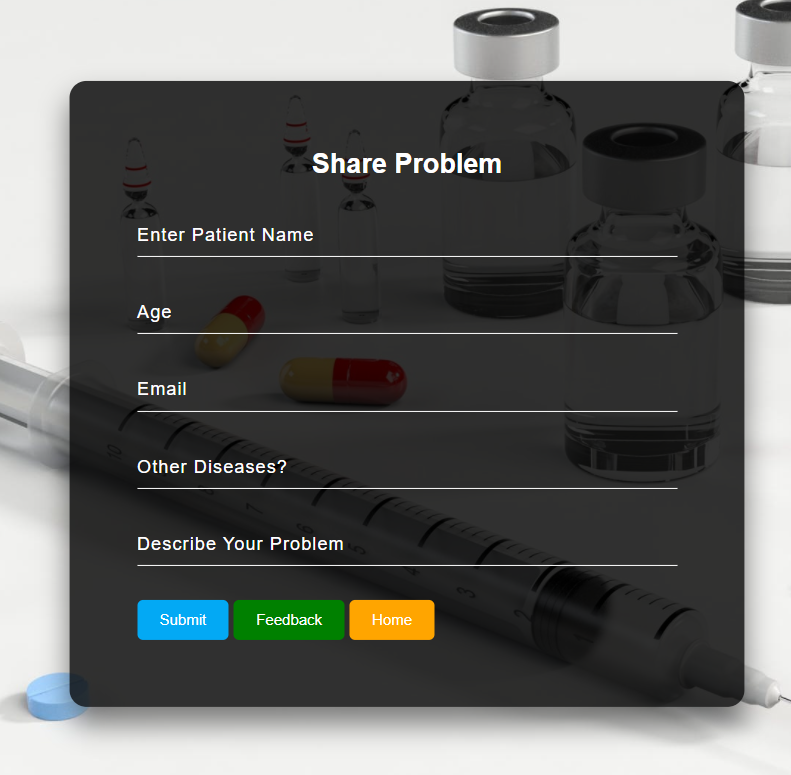
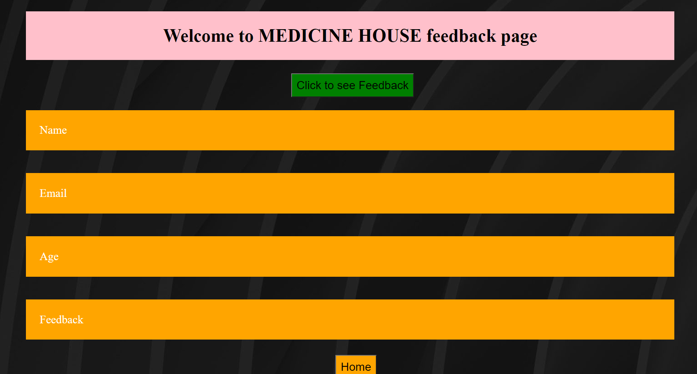

# Welcome to Get Suggestion page

## 1. Share Problem
Fill up the following boxes to submit your problem.

1. First text box is for patients name.
2. Second one is for mentioning the patient age.
3. Third one is for patient email.
4. Forth one is for describing other deseases if he/she has.
5. Last one is for sharing the current problem to get doctor assistance.

`Submit`  - By pressing the `Submit` button you can submit your problem. Then, it will redirect you to the Home Page. Remember one thing you cant keep any field blank.
## 1.1 Share problem - Form Fill Up Image

## 2. Feedback Checking
`Feedback` - Pressing the feedback button one can get his feedback by following a quick step.

1. Firstly one have to click `Click to see Feedback` button.
2. He will be promped to provide his email.
3. By pressing `OK` he can see his feedback.

`Home` - This button is used to return to the home page.

## 2.1 Get Feedback Image

# 3. Contact us
* Md. Anisur Rahman
* email: `mrahman191191@bscse.uiu.ac.bd`